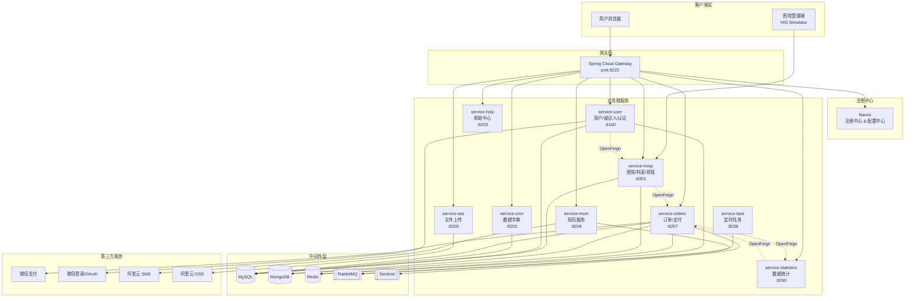
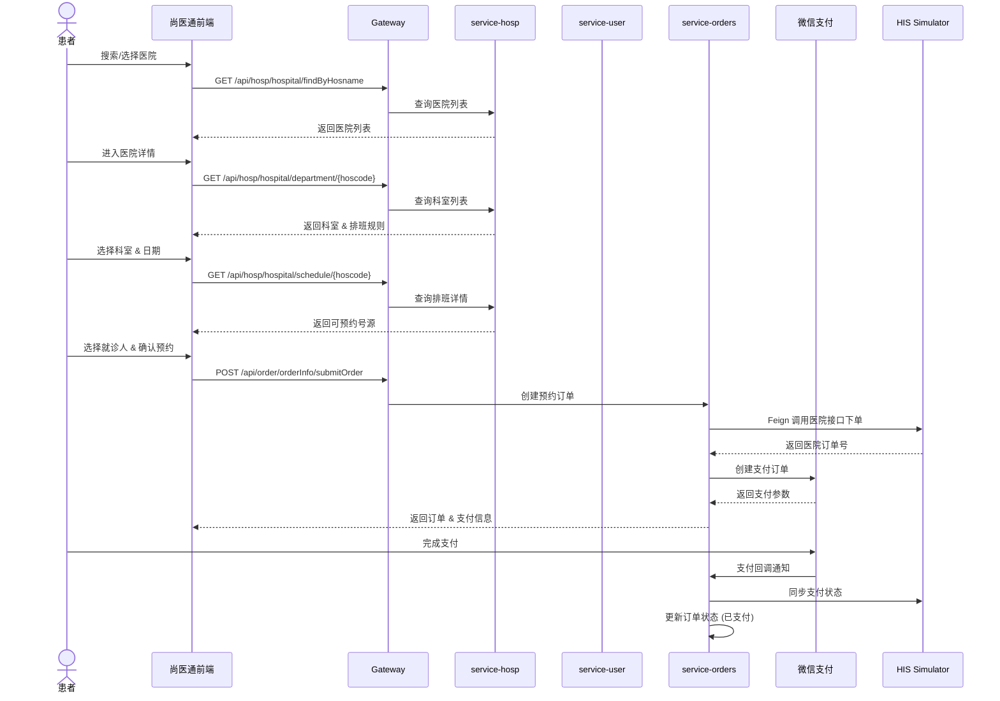
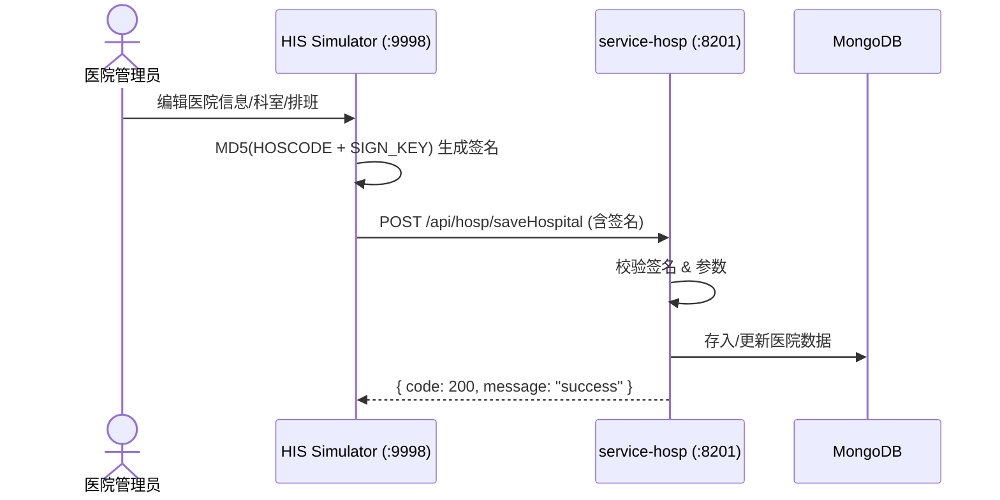

# 尚医通 — 智慧医疗预约挂号平台

<div align="center">

**基于 Spring Cloud Alibaba 微服务架构的新一代医疗预约挂号平台**

[](https://spring.io/projects/spring-boot)
[](https://spring.io/projects/spring-cloud)
[](https://openjdk.org/projects/jdk/17/)
[](https://nuxt.com/)
[](LICENSE)

</div>

---

## 项目简介

**尚医通（ShangYiTong）** 是一个面向智慧医疗场景的在线预约挂号平台。平台对接多家医院信息系统（HIS），为患者提供一站式的医院查询、科室浏览、医生排班查看、在线预约挂号、微信支付、就诊人管理等全流程服务。

系统采用 **Spring Cloud Alibaba 微服务架构** 构建后端，以 **Nuxt.js + Vue** 构建 SSR 前端，配合独立部署的 **医院模拟器（HIS Simulator）** 完成完整的医疗挂号业务闭环。

---

## 系统架构



---

## 技术栈

| 层级 | 技术选型 | 版本 |
|------|----------|------|
| **后端框架** | Spring Boot + Spring Cloud Alibaba | 3.0.5 / 2022.0.2 |
| **服务发现** | Nacos | 2022.0.0.0-RC2 |
| **服务网关** | Spring Cloud Gateway | 2022.0.2 |
| **远程调用** | OpenFeign | 2022.0.2 |
| **限流熔断** | Sentinel | 2022.0.2 |
| **消息队列** | RabbitMQ | — |
| **ORM** | MyBatis-Plus | 3.5.3.1 |
| **关系数据库** | MySQL | 8.0 |
| **文档数据库** | MongoDB | — |
| **缓存** | Redis + Spring Cache | — |
| **认证鉴权** | JWT (jjwt) | 0.11.2 |
| **API 文档** | Knife4j (Swagger) | 4.1.0 |
| **文件存储** | 阿里云 OSS | 3.9.1 |
| **短信服务** | 阿里云 SMS | 4.1.1 |
| **前端框架** | Nuxt.js 2 + Vue 2 | ^2.0.0 |
| **UI 组件库** | Element UI | 2.x |
| **HTTP 客户端** | Axios | ^0.19.2 |
| **支付** | 微信支付 JSAPI | — |

---

## 项目结构

```
my-ai-platform/
├── his-system/                              # 医院模拟器（HIS Simulator）
│   └── hospital-manage/                     # 独立 Spring Boot 应用 (port: 9998)
│       ├── controller/                      # 医院管理 & API 控制器
│       ├── service/                         # 业务逻辑（预约/支付/排班）
│       ├── model/                           # 医院设置/排班/订单/患者实体
│       └── templates/                       # Thymeleaf 管理页面
│
└── yygh-platform/                           # 尚医通预约挂号平台
    ├── frontend/
    │   └── yygh-sitedemo/                   # Nuxt.js SSR 前端项目
    │       ├── pages/                        # 13 个业务页面
    │       │   ├── index.vue                 #   - 首页（医院搜索 & 筛选）
    │       │   ├── hospital/                 #   - 医院详情 / 排班 / 确认预约
    │       │   ├── user/                     #   - 用户中心
    │       │   ├── patient/                  #   - 就诊人管理
    │       │   ├── order/                    #   - 订单详情
    │       │   ├── weixin/                   #   - 微信 OAuth 回调
    │       │   └── help/                     #   - 帮助中心
    │       └── api/                          # 前端 API 服务层（9 个模块）
    │
    └── backend/
        └── yygh_parent/                     # Maven 父 POM（Spring Cloud 微服务）
            ├── common/                      # 公共模块
            │   ├── service_utils/            # 统一返回 / JWT / Redis / 异常处理
            │   └── rabbit_util/              # RabbitMQ 发送工具
            ├── model/                        # 共享实体 & VO & 枚举
            ├── service/                      # 业务微服务（9 个）
            │   ├── service_hosp/             #   - 医院服务    :8201
            │   ├── service_cmn/              #   - 字典服务    :8202
            │   ├── service_user/             #   - 用户服务    :8160
            │   ├── service_help/             #   - 帮助中心    :8203
            │   ├── service_msm/              #   - 短信服务    :8204
            │   ├── service_oss/              #   - 文件服务    :8205
            │   ├── service_orders/           #   - 订单服务    :8207
            │   ├── service_task/             #   - 定时任务    :8208
            │   └── service_statistics/       #   - 统计服务    :8260
            ├── service_client/               # Feign 声明式客户端
            └── service_gateway/              # Spring Cloud Gateway :8222
```

---

## 核心功能

### 患者端（微信 H5 / Web）

| 模块 | 功能 |
|------|------|
| **首页** | 按医院等级、地区筛选医院列表，关键词搜索 |
| **医院详情** | 查看医院信息、科室列表、排班规则 |
| **预约挂号** | 选择科室 → 查看排班 → 选择就诊人 → 确认预约 |
| **用户中心** | 手机号登录 / 微信扫码登录，实名认证 |
| **就诊人管理** | 添加/编辑/删除就诊人信息 |
| **订单管理** | 查看预约订单、取消预约、支付状态跟踪 |
| **微信支付** | 在线支付挂号费用 |
| **帮助中心** | 常见问题、用户反馈 |

### 医院端（HIS Simulator）

| 模块 | 功能 |
|------|------|
| **医院信息管理** | 录入/修改医院基本信息、上传至平台 |
| **科室管理** | 管理科室列表，同步至尚医通平台 |
| **排班管理** | 编辑医生排班数据，批量上传 |
| **订单处理** | 接收预约订单、更新支付状态、处理取消 |
| **签名管理** | 维护医院签名密钥，保证数据传输安全 |

### 平台管理端

| 模块 | 功能 |
|------|------|
| **医院审核** | 医院上线/下线、信息审核 |
| **数据字典** | 省市区/医院等级等基础数据管理、Excel 导入导出 |
| **数据统计** | 订单量、预约量等经营数据聚合分析 |
| **流量控制** | 热点医院预约限流（Sentinel），防止恶意抢号 |

---

## 业务流程

### 预约挂号全流程



### 医院数据同步流程



---

## 数据存储策略

系统采用 **混合持久化** 设计，针对不同数据特征选择最优存储方案：

| 数据类型 | 存储引擎 | 选型理由 |
|----------|----------|----------|
| 医院/科室/排班 | **MongoDB** | 字段灵活，医院间数据结构差异大；嵌套文档适合科室-排班层级 |
| 用户/患者/订单 | **MySQL** | 强事务要求（订单支付），关系模型清晰 |
| 数据字典 | **MySQL + Redis** | 基础数据静态，Redis 缓存提速 |
| 短信验证码 | **Redis** | 临时数据，5 分钟过期 |
| JWT Token | **Redis** | 支持主动失效 & 过期管理 |

---

## 快速开始

### 环境要求

| 组件 | 版本要求 | 说明 |
|------|----------|------|
| JDK | 17 (yygh) / 1.8 (his) | 两个子系统 JDK 版本不同 |
| Maven | 3.6+ | 构建管理 |
| MySQL | 8.0+ | 关系数据库 |
| MongoDB | 4.0+ | 文档数据库 |
| Redis | 6.0+ | 缓存服务 |
| RabbitMQ | 3.9+ | 消息队列 |
| Nacos | 2.x | 注册中心 & 配置中心 |
| Node.js | 14+ | 前端构建 |

### 1. 启动基础中间件

确保 MySQL、MongoDB、Redis、RabbitMQ、Nacos 均已启动并可用。

Nacos 默认地址：`192.168.88.134:8848`（可在各模块 `application.yml` 中修改）。

### 2. 初始化数据库

```bash
# 创建 MySQL 数据库
mysql -u root -p < docs/sql/init.sql

# MongoDB 集合会在首次写入时自动创建，无需手动建表
```

### 3. 启动后端微服务

```bash
# 在 yygh_parent 目录下编译全部模块
cd yygh-platform/backend/yygh_parent
mvn clean install -DskipTests

# 按需启动各服务（Spring Boot 应用，任意顺序）
cd service/service_hosp  && mvn spring-boot:run    # 医院服务 :8201
cd service/service_cmn   && mvn spring-boot:run    # 字典服务 :8202
cd service/service_user  && mvn spring-boot:run    # 用户服务 :8160
cd service/service_help  && mvn spring-boot:run    # 帮助中心 :8203
cd service/service_msm   && mvn spring-boot:run    # 短信服务 :8204
cd service/service_oss   && mvn spring-boot:run    # 文件服务 :8205
cd service/service_orders && mvn spring-boot:run   # 订单服务 :8207
cd service/service_task  && mvn spring-boot:run    # 定时任务 :8208
cd service/service_statistics && mvn spring-boot:run # 统计服务 :8260

# 启动网关（最后启动）
cd service_gateway       && mvn spring-boot:run    # 网关 :8222
```

### 4. 启动 HIS 医院模拟器

```bash
cd his-system/hospital-manage
mvn spring-boot:run    # 端口 :9998
```

### 5. 启动前端

```bash
cd yygh-platform/frontend/yygh-sitedemo
npm install
npm run dev            # Nuxt.js SSR 开发模式
```

### 6. 访问

| 入口 | 地址 | 说明 |
|------|------|------|
| 患者端 | `http://localhost:3000` | Nuxt.js SSR 渲染 |
| 医院管理端 | `http://localhost:9998` | HIS Simulator Thymeleaf 页面 |
| API 文档 | `http://localhost:{port}/doc.html` | Knife4j 文档（各服务独立） |
| Nacos 控制台 | `http://192.168.88.134:8848/nacos` | 服务列表 & 配置管理 |

---

## 微服务通信说明

| 通信方式 | 场景 | 实现 |
|----------|------|------|
| **OpenFeign** | 服务间同步调用 | `service_client/` 下各 Feign 客户端 |
| **RabbitMQ** | 异步解耦（短信发送、订单通知、定时任务） | `rabbit_util/` 统一封装 |
| **Gateway** | 前端统一入口，路由转发 | `service_gateway/` 配置路由规则 |
| **HTTP 直连** | HIS 模拟器 → service-hosp | `HttpRequestHelper` + MD5 签名 |

---

## 安全机制

- **数据传输签名**：医院管理端与平台间使用 `MD5(HOSCODE + SIGN_KEY)` 进行请求签名校验，防止数据篡改
- **JWT 认证**：用户端采用 JWT Token（HMAC-SHA，1 小时过期），配合 Redis 支持主动失效
- **Gateway 网关鉴权**：统一拦截验证 Token，未登录请求拒绝转发
- **Sentinel 限流**：高频接口（如热门医院预约）配置热点参数限流，保障系统稳定性

---

## License

本项目仅供学习交流使用，未经许可不得用于商业用途。

---

<div align="center">

**尚医通 — 让就医更简单**

</div>
